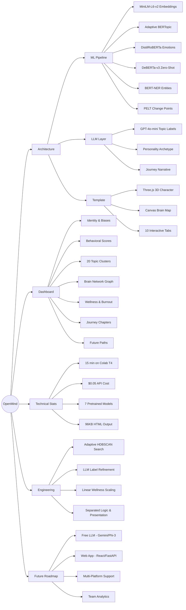

# OpenMind

**Your AI conversations reveal how you think. OpenMind shows you.**

OpenMind analyzes your ChatGPT conversation history and generates an interactive dashboard that surfaces your cognitive patterns, topic interests, emotional trends, behavioral evolution, and personality insights — all discovered from your data, with zero assumptions about who you are or what you discuss.

---

## What You Get

A self-contained HTML dashboard with 10 interactive sections:

| Section | What It Shows |
|---------|---------------|
| **Home** | 3D animated character, scrollable timeline, key stats, topic chart, top conversations |
| **Identity** | AI-generated personality archetype, thinking style breakdown, cognitive biases |
| **Intelligence** | Behavioral scores (radar chart), score explanations, peak activity heatmap |
| **Topics** | All discovered topics (bar chart), topic evolution over time, thinking phases |
| **Brain Map** | Topic connection network graph, strongest links, abandoned topics |
| **Wellness** | Burnout risk gauge, emotional trend charts, late-night patterns, observations |
| **Coach** | Personalized coaching nudges, data-backed insights |
| **Journey** | Your AI evolution story told in chapters with narrative |
| **Future** | Predicted directions based on recent patterns |
| **Share** | Screenshot-ready card with your personality and key stats |

## How It Works

```
Your ChatGPT Export (.json)
        │
        ▼
┌────────────────────────┐
│  ML Pipeline (Colab)   │  Sentence embeddings, BERTopic clustering,
│  15 steps, 7 models    │  emotion analysis, NER, statistical analysis
│                        │  → findings.json
└───────────┬────────────┘
            │
            ▼
┌────────────────────────┐
│  LLM (OpenAI API)      │  Reads actual messages, names topics,
│  2 calls, ~$0.05       │  generates personality + journey + insights
│                        │  → dynamic content
└───────────┬────────────┘
            │
            ▼
┌────────────────────────┐
│  Dashboard Template    │  Pre-built HTML with 3D character, brain map,
│  45KB, 10 tabs         │  SVG gauges, Chart.js — data injected
│                        │  → openmind_dashboard.html (96KB)
└────────────────────────┘
```

## Quick Start

### 1. Export Your ChatGPT Data
Go to ChatGPT → Settings → Data Controls → Export Data. You'll receive an email with a ZIP file within a few hours. Unzip it — you need the `conversations.json` file (or the `chunk_*.json` files if it's split).

### 2. Open the Notebook
[](https://colab.research.google.com/github/YOUR_USERNAME/openmind/blob/main/OpenMind.ipynb)

Set runtime to **GPU** (Runtime → Change runtime type → T4).

### 3. Upload Your Data
Run the first few cells. When prompted, upload your `conversations.json` or chunk files.

### 4. Enter API Key
You'll need an OpenAI API key for two steps (topic labeling + content generation). Total cost is ~$0.05 per run.

### 5. Run All & Download
Run all remaining cells (~15-20 minutes on T4). Download `ai_mirror_dashboard.html` and open it in any browser.

---

## Pipeline Details

| Step | Model / Method | Purpose |
|------|----------------|---------|
| Embeddings | `all-MiniLM-L6-v2` (384d) | Encode messages into semantic vectors |
| Topic Discovery | BERTopic (UMAP + HDBSCAN + c-TF-IDF) | Unsupervised topic clustering with adaptive config search |
| Topic Labeling | GPT-4o-mini | Read representative messages, generate meaningful topic names |
| Emotions | `emotion-english-distilroberta-base` | 7-class emotion classification per message |
| Interaction Types | `DeBERTa-v3-base-mnli` (zero-shot) | Classify what users DO with AI (question, instruction, brainstorm, etc.) |
| Entity Extraction | `bert-base-NER` | Extract people, organizations, locations from text |
| Phase Detection | PELT (ruptures) | Find statistically significant shifts in activity patterns |
| Behavioral Stats | z-scores, chi-square, linear regression | Activity bursts, complexity trends, wellness scoring |
| Content Generation | GPT-4o | Personality, journey narrative, insights, coaching, future paths |

### Key Design Decisions

- **Adaptive BERTopic search:** No single clustering configuration works for all users. We try 6 combinations of HDBSCAN parameters and automatically select the best result.
- **LLM topic labeling:** TF-IDF keywords produce labels like "Rent Bed Apartment Issues." The LLM reads actual messages and produces "Hostel Management System." This single step transforms dashboard quality.
- **Three-layer architecture:** ML computes patterns. LLM generates understanding. Template renders visuals. Each layer does what it's best at.
- **Statistical wellness scoring:** No arbitrary formulas. Burnout factors use simple linear scaling. Observations generated only when statistical tests show p < 0.05.

---

## Repository Structure

```
openmind/
├── OpenMind.ipynb              # Complete pipeline (run in Google Colab)
├── README.md                   # This file
└── examples/
    └── sample_dashboard.html   # Example output (anonymized)
```

The dashboard template is embedded inside the notebook (base64-encoded) so the notebook is fully self-contained — no external file dependencies.

---

## Requirements

- Google Colab with T4 GPU (free tier works)
- OpenAI API key (~$0.05 per run)
- ChatGPT data export (JSON format)

## Privacy

Your conversation data is processed locally in your Colab runtime. Raw messages are sent to OpenAI only for topic labeling (5-8 sample messages per cluster, ~100 messages total) and are subject to OpenAI's data usage policy. The final dashboard contains only aggregated statistics and LLM-generated summaries — no raw messages.

---

## Roadmap

- [ ] Replace OpenAI with free LLM (Gemini Flash or local model)
- [ ] Web app with drag-and-drop upload (no Colab needed)
- [ ] Mobile-responsive dashboard
- [ ] Multi-platform support (Claude, Gemini, Copilot exports)
- [ ] Anonymized benchmarking (compare your patterns to aggregate)

---
## Project Mind Map

## License

MIT

## Contributing

Issues and PRs welcome. If you run the pipeline and find bugs or have suggestions, open an issue with your notebook output (findings.json, not your raw data).
